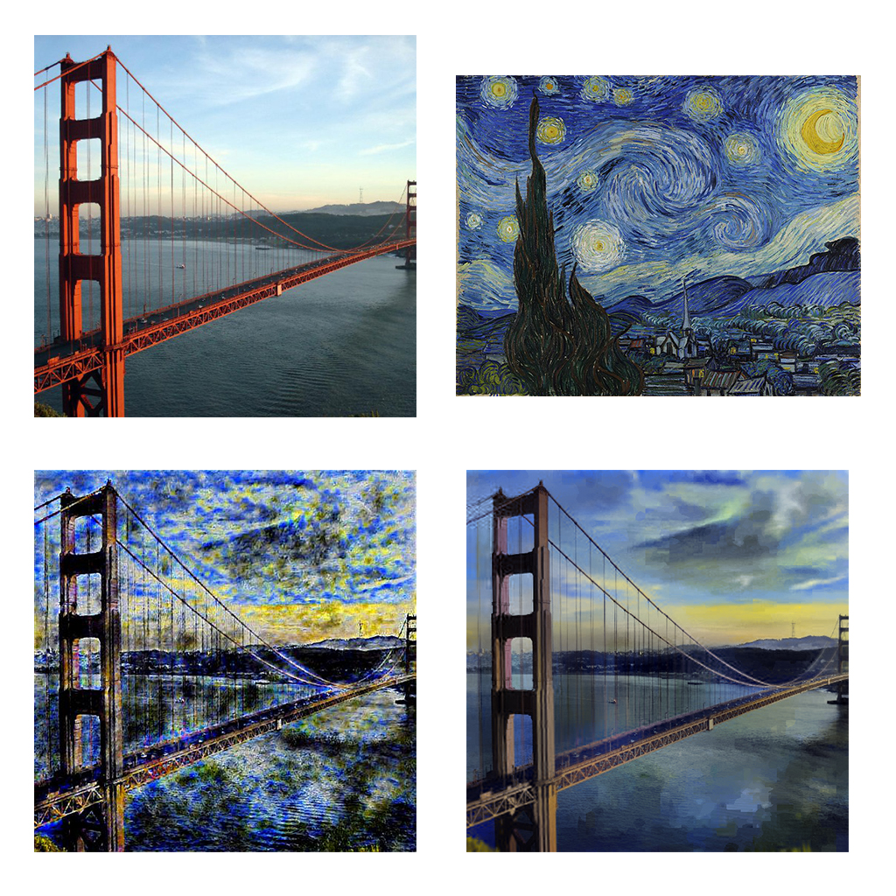
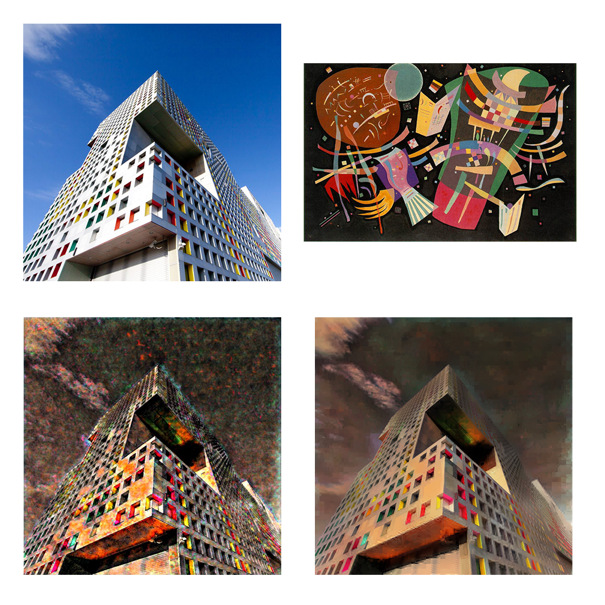
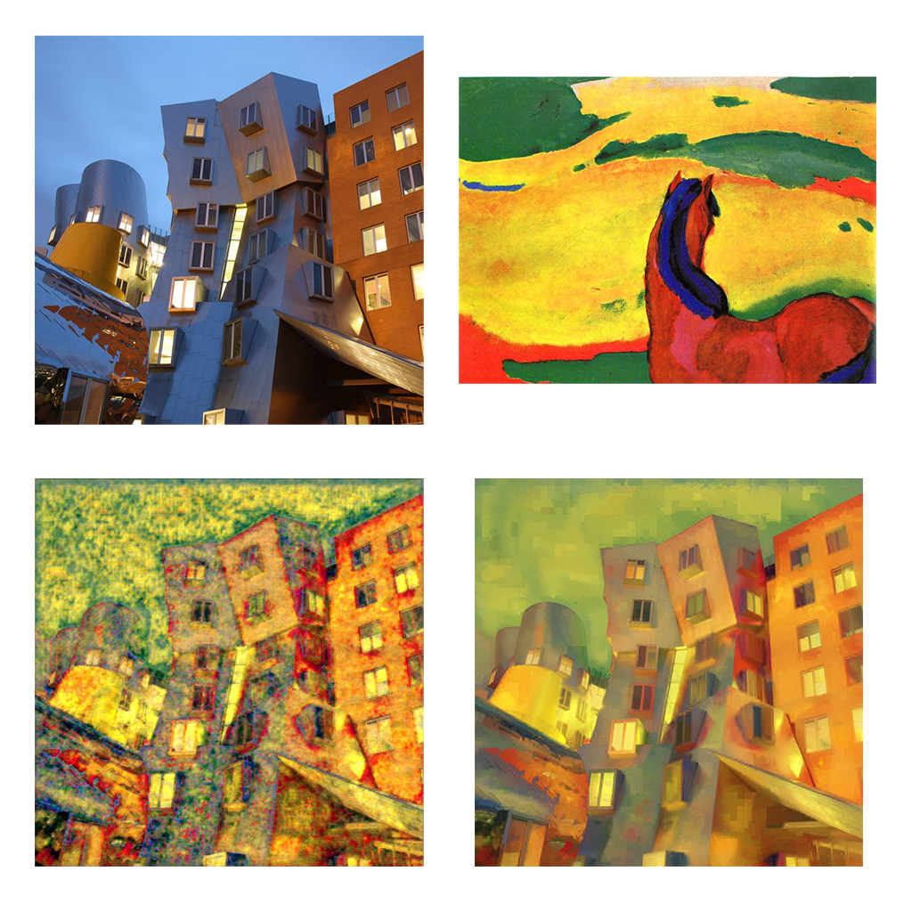

# PhotoWCT with closed form matting
**NOTE: TO BE UPDATED**

Torch implementation of the papers [Universal Style Transfer](https://arxiv.org/pdf/1705.08086.pdf) and [A Closed-form Solution to Photorealistic Image Stylization](https://arxiv.org/abs/1802.06474)

This is an unofficial implementation.
The original implementation of [Universal Style Transfer](https://github.com/Yijunmaverick/UniversalStyleTransfer) and [A Closed-form Solution to Photorealistic Image Stylization](https://github.com/NVIDIA/FastPhotoStyle) are there <-

## How to run it
1. Download the decoders from the directories
2. ```python3 run_wct.py --x 4 --style <path to style> --content <path to content> --output <output file name> --decoder decoder_1/dec_1849.pkl,decoder_2/dec_1849.pkl,decoder_3/dec_1849.pkl,decoder_4/dec_1849.pkl --smooth True```

## How to train it
1. Get the 2017 MS COCO train and validation datasets and unzip them
2. Download PyTorch VGG16 model
```wget https://download.pytorch.org/models/vgg16-397923af.pth```
3. For every layer(x = 1 to 4) train the decoder. It is recommended to run training twice with starting lr 0.001 and then 0.0001
```python3 --x <layer number> --batch_size <64> --decoder <saved checkpoint if any> --optimizer <optimized checkpoint if any>```
*Note: all decoders & optimizers are saved in the dir `decoder_<x>`*

## Results
Clockwise from top left: image, style, whitening+coloring, whitening+coloring+smoothing

1. 
2. 
3. 

## TODO
1. Upload trained files
2. Make training easier
3. Make running easier